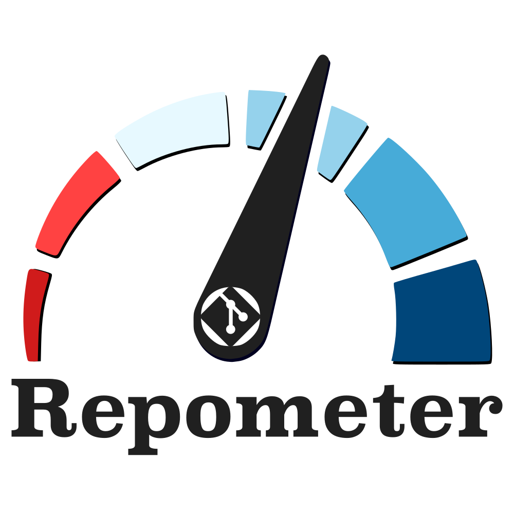

# Repometer



Online version control platforms offer insights into traffic and engagement with
source code repositories, but only in limited ways and over short windows of
time. Scientific software teams at Sandia and elsewhere want to collect and
store engagement data to help tell their story and the impact their work has
on the community. Repometer aims to supplement existing capabilities by collecting
timely and insightful data from GitHub and GitLab repositories and passing
it to a database for longer-term storage.

## Requirements
The required packages for this utility can be found in the
[Requirements file](requirements.txt).

### Database Connection
The utility requires a properly created database to which the data collected
can be passed and stored. We have included a file with the necessary schema
for this database in `repometer/database/repometer_database.sql`.

To use this script (for a MySQL database):
```
$ mysql -u username -p database_name < repometer_database.sql
```

### Database Credentials
The utility also requires the placement of a configuration file for the database 
in the `repometer/database/` directory of the format:

``` 
"""
repometer/database/config.py
"""

config = {
    'user': username,
    'password': password,
    'host': hostname,
    'database': databasename
}

```
If you intend to use the `backup_database` routine, this also requires a configuration file
for the database in the `repometer/database/` directory of the format:
```
"""
repometer/database/backup_config.py
"""

config = {
    'user': username,
    'password': password,
    'host': hostname,
    'database': databasename
}

```

**WE HIGHLY RECOMMEND STORING THESE CREDENTIALS IN A SEPARATE, ACCESS-CONTROLLED
REPOSITORY.**

## Install
Clone this repository to your local machine, `cd` into the repository, and run:
```
$ python setup.py install
```
If you'd prefer to use the package in a development format, instead run:
```
$ python setup.py develop
```

## Usage
This package can be initiated via a convenient console command:
```
$ repometer -h

usage: repometer [-h]
{addclient, removeclient, addrepository, removerepository, showdata, collectdata, status}
...

The main function for Repometer. Type 'repometer COMMAND --help'
to get information about a particular command.

optional arguments:
    -h, --help            show this help message and exit

commands:
    {addclient, removeclient, addrepository,
        removerepository, showdata, collectdata, status}

```
Each of the seven commands has its own arguments. For example:
```
$ repometer addclient --help

usage: repometer addcustomer[-h] Customer_Name

Add a customer to the database.

positional arguments:
    Customer_Name

```

## Testing
There are extensive unit tests included with this package which are powered
by `pytest`. The unit tests require the regular `config.py` files, as listed
above, but also require a `repometer/tests/config.py` file (sample included)
with the following dictionaries:

```
"""
INCORRECT DB NAME
"""
database = 'incorrect name'
host = ''
user = ''
password = ''

incorrect_DBname_config = {
    'user': user,
    'password': password,
    'host': host,
    'database': database
}

"""
INCORRECT HOST NAME
"""
database = ''
host = 'incorrect host'
user = ''
password = ''

incorrect_Hostname_config = {
    'user': user,
    'password': password,
    'host': host,
    'database': database
}


"""
INCORRECT USERNAME
"""
database = ''
host = ''
user = 'incorrect user'
password = ''

incorrect_Username_config = {
    'user': user,
    'password': password,
    'host': host,
    'database': database
}

"""
INCORRECT PASSWORD
"""
database = ''
host = ''
user = ''
password = 'incorrect password'

incorrect_Password_config = {
    'user': user,
    'password': password,
    'host': host,
    'database': database
}

"""
EVERYTHING CORRECT
"""
database = ''
host = ''
user = ''
password = ''

correct_config = {
    'user': user,
    'password': password,
    'host': host,
    'database': database
}
```

**WE HIGHLY RECOMMEND STORING THESE CREDENTIALS IN A SEPARATE, ACCESS-CONTROLLED
REPOSITORY.**

## Copyright Notice

Copyright 2022 National Technology & Engineering Solutions of Sandia, LLC
(NTESS). Under the terms of Contract DE-NA0003525 with NTESS, the U.S.
Government retains certain rights in this software.
